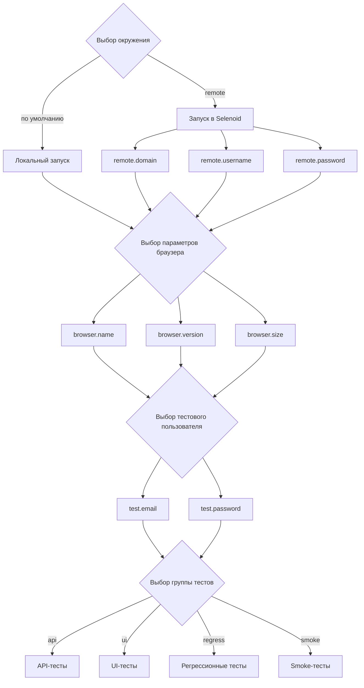

# Автоматизация тестирования сайта [Издательства АЗБУКА](https://azbooka.ru)


---

## Содержание

* [Описание](#описание)
* [Технологии и инструменты](#технологии-и-инструменты)
* [Реализованные проверки](#реализованные-проверки)
* [Запуск тестов](#запуск-тестов)
* [Сборка в Jenkins](#сборка-в-jenkins)
* [Интеграция с Allure Report](#интеграция-с-allure-report)
* [Интеграция с Allure TestOps](#интеграция-с-allure-testops)
* [Уведомления в Telegram](#уведомления-в-telegram)
* [Видео выполнения теста](#видео-выполнения-теста)
* [Правовая информация](#правовая-информация)

---

## Описание

**Издательство АЗБУКА** — одно из крупнейших издательств в России. Ежегодно выпускает более 100 книжных серий и отдельных проектов. В издательство входят четыре импринта: «Азбука», «Иностранка», «КоЛибри» и «Махаон».

### Особенности проекта

* **Современная архитектура тестов**
    * Использован шаблон проектирования *Page Object* для поддержки чистоты и переиспользуемости кода;
    * Конфигурации написаны с использованием библиотеки [Owner](https://github.com/matteobaccan/owner), что обеспечивает гибкость и удобство настройки окружений.

* **Удобные сценарии запуска**
    * Локальный и удалённый запуск;
    * Фильтрация тестов по тегам;
    * Возможность запуска напрямую из Allure TestOps.

* **Генерация данных и модели**
    * Библиотека [Datafaker](https://github.com/datafaker-net/datafaker) используется для создания тестовых данных "на лету";
    * Для API-моделей применен [Lombok](https://github.com/projectlombok/lombok), что позволило сократить шаблонный код.

* **Кастомные расширения для тестов**
    * `@WithLogin` — автоматическая авторизация в UI-тестах;
    * `@Layer`, `@Microservice`, `@Manual` — интеграция с Allure TestOps для категоризации тестов.

* **CI/CD-процессы**
  * При каждом пуше в основные ветки и перед мержем пулл-реквестов запускается сборка проекта в GitHub Actions.

* **Интеграция с Allure**
    * После прохождения автотестов формируется наглядный Allure-отчет:
        * Шаги выполнения;
        * Скриншот страницы перед завершением теста;
        * Видео прохождения сценария;
        * HTML-код страницы и логи браузера.
    * Результаты автоматически синхронизируются с Allure TestOps.

* **Уведомления о результатах**
    * Итоги тестового прогона отправляются в Telegram-чат с помощью библиотеки [Allure notifications](https://github.com/qa-guru/allure-notifications).

---

## Технологии и инструменты

<p align="center">
<a href="https://www.jetbrains.com/idea/"></a>
<a href="https://www.java.com/ru/"></a>
<a href="https://junit.org/junit5/"></a>
<a href="https://selenide.org/"></a>
<a href="https://rest-assured.io/"></a>
<a href="https://maven.apache.org/"></a>
<a href="https://git-scm.com/"></a>
<a href="https://github.com/"></a>
<a href="https://www.jenkins.io/"></a>
<a href="https://aerokube.com/selenoid/"></a>
<a href="https://allurereport.org/"></a>
<a href="https://qameta.io/"></a>
<a href="https://telegram.org/"></a>
</p>

* **Среда разработки**
    * [Intellij IDEA](https://www.jetbrains.com/idea/)

* **Язык программирования**
    * [Java](https://www.java.com/)

* **Фреймворки для тестирования**
    * [JUnit 5](https://junit.org/) — современный тестовый фреймворк с поддержкой аннотаций, параметризации и расширений
    * [Selenide](https://selenide.org/) — лаконичная обёртка над Selenium WebDriver для UI-тестов
    * [REST Assured](https://rest-assured.io/) — декларативное тестирование REST API

* **Сборка и управление зависимостями**
    * [Maven](https://maven.apache.org/) — сборка, управление зависимостями и настройка запуска тестов

* **Контроль версий и репозиторий**
    * [Git](https://git-scm.com/) — система контроля версий
    * [GitHub](https://github.com/) — хостинг и управление проектом

* **Инфраструктура и CI/CD**
  * [GitHub Actions](https://github.com/features/actions) — автоматизация рабочих процессов и CI/CD прямо в GitHub.
  * [Jenkins](https://www.jenkins.io/) — автоматизация прогонов тестов, формирование отчётов и интеграция с внешними сервисами
  * [Selenoid](https://aerokube.com/selenoid/) — лёгкая и быстрая инфраструктура для параллельного запуска браузеров в Docker

* **Отчётность и интеграции**
    * [Allure Report](https://allurereport.org/) — детализированные отчёты о тестовых прогонах
    * [Allure TestOps](https://qameta.io/testops/) — управление тестами и аналитика результатов
    * [Telegram](https://core.telegram.org/bots) — интеграция через бота для оперативных уведомлений о статусе прогонов

---

## Реализованные проверки

<details>
   <summary>API</summary>

**Авторизация**
- Авторизация с валидными данными через API
- Авторизация с несуществующим логином через API
- Авторизация с неправильным паролем через API
- Авторизация с пустым логином
- Авторизация с пустым паролем
- Авторизация с отсутствующим логином
- Авторизация с отсутствующим паролем
- Авторизация с отсутствующим телом запроса
- Выход из аккаунта с валидным токеном
- Выход из аккаунта с невалидным токеном
- Выход из аккаунта без токена

**Профиль пользователя**
- Получение информации о текущем пользователе
- Изменение информации о текущем пользователе без загрузки аватара
- Загрузка аватара пользователя с разными расширениями файлов

**Закладки**
- Получение пустого списка закладок
- Получение не пустого списка закладок
- Добавление книги в закладки через API, когда список закладок пустой
- Добавление книги в закладки через API, когда список закладок не пустой
- Удаление книги из закладок через API, когда в списке закладок только одна книга
- Удаление книги из закладок через API, когда в списке закладок несколько книг
</details>

<details>
   <summary>UI</summary>

**Авторизация**
- Авторизация с валидными данными
- Авторизация с несуществующим логином
- Авторизация с неправильным паролем
- Авторизация без заполнения полей
- Выход из аккаунта
- Переход на страницу профиля после выхода из аккаунта

**Профиль пользователя**
- Отображение информации в профиле с загруженным аватаром
- Изменение информации в профиле с загрузкой аватара

**Закладки**
- Добавление книги в закладки, когда список закладок пустой, с переходом на страницу "Закладки"
- Добавление книги в закладки, когда список закладок не пустой
- Удаление книги из закладок на странице книги, когда в списке закладок только одна книга, с переходом на страницу "Закладки"
- Удаление книги из закладок на странице книги, когда в списке закладок несколько книг
- Удаление книги из закладок на странице "Закладки", когда в списке закладок только одна книга
- Удаление книги из закладок на странице "Закладки", когда в списке закладок несколько книг
- Отображение книг в списке закладок
- Отображение счетчика закладок
- Переход к закладкам через ссылку в шапке
- Счетчик закладок не отображается, когда нет закладок
- Счетчик закладок отображается, когда есть закладки
</details>

<details>
   <summary>Ручные проверки</summary>

**Поиск**
- Дропдаун поиска отображает книги в блоке "Книги"
- Дропдаун поиска отображает статьи в блоке "Статьи"
- Дропдаун поиска показывает сообщение, если нет результатов
- Переход на страницу поиска по нажатию на клавишу Enter
- Переход на страницу поиска по кнопке "Показать еще"
- Нажатие на книгу в дропдауне открывает страницу книги
</details>

___

## Запуск тестов



```bash
mvn clean test -P {profile} -Dgroups={tags} \
  -Dremote.domain={domain} -Dremote.username={username} -Dremote.password={password} \
  -Dbrowser.name={name} -Dbrowser.version={version} -Dbrowser.size={size} \
  -Dtest.email={email} -Dtest.password={password}
```

- `profile` — выбор окружения (опционально):
    - `remote` - запуск UI-тестов в Selenoid
    - по умолчанию тесты запускаются локально
- `groups` — теги тестов для запуска:
    - `ui` — UI-тесты
    - `api` — API-тесты
    - `regress` — регрессионные тесты
    - `smoke` — smoke тесты
- `remote.*` — данные для авторизации на удалённом стенде:
    - `username`
    - `password`
- `browser.*` — параметры браузера для UI тестов: название, версия, размер окна
    - `name` (по умолчанию `chrome`)
    - `version`
    - `size` (по умолчанию `1920x1080`)
- `test.*` — логин и пароль для авторизации тестовым пользователем в тестах:
    - `email`
    - `password`

<details>
   <summary>Дополнительные команды:</summary>

1\. Формирование Allure-отчета:

```bash
mvn allure:report
```

По умолчанию отчет генерируется в папку `target/allure-results`.

2\. Формирование Allure-отчета, запуск локального HTTP-сервера и открытие в браузере:

```bash
mvn allure:serve
```
</details>

### Локальная конфигурация

Для упрощения локального запуска можно создать файлы `remote.properties` и `user.properties` в корневой папке `config`.

В папке есть шаблоны: [remote.example.properties](/config/remote.example.properties) и [user.example.properties](/config/user.example.properties). Необходимо скопировать их, убрав из имени `.example`, и заполнить своими данными.

---

## Сборка в Jenkins

[Jenkins](https://www.jenkins.io/) — это популярный инструмент для автоматизации сборки, тестирования и деплоя проектов.

В проекте используется для:
* удалённого запуска автотестов,
* формирования Allure-отчетов по результатам прогонов,
* интеграции с уведомлениями в Telegram.

Для запуска сборки необходимо перейти в раздел `Build with Parameters` и нажать кнопку `Build`:


Раздел `Build with Parameters` позволяет задать необходимые параметры перед запуском сборки:


---

## Интеграция с Allure Report

[Allure Report](https://allure.qatools.ru/) — это инструмент для визуализации результатов тестов, который формирует наглядные и подробные отчёты.

В проекте используется для:
* отображения шагов выполнения теста,
* демонстрации скриншотов и видео,
* анализа логов и исходного кода страницы,
* отслеживания успешных и упавших тестов.

На вкладке Overview отображается общий результат прогона тестов: диаграммы успешных и упавших тестов, распределение по сьютам и функциональным фичам.


При переходе в конкретный тест видны подробности: шаги теста, скриншоты, видео и логи браузера.


---

## Интеграция с Allure TestOps

[Allure TestOps](https://qameta.io/testops/) — это облачная платформа для управления тестами и анализа результатов.

В проекте используется для:
* хранения тест-кейсов,
* группировки тестов по функциональностям и пользовательским историям,
* отслеживания выполнения тестов в динамике,
* интеграции с Jenkins и отчетами Allure.

Интеграция с Jenkins позволяет запускать выбранные тесты и отслеживать их выполнение в реальном времени.


Прогоны тестов отображаются на графиках и диаграммах, что позволяет быстро оценивать динамику и стабильность тестов.


Тестовые сценарии автоматически синхронизируются с кодом проекта после завершения прогонов, обеспечивая актуальность кейсов.


---

## Уведомления в Telegram

Результаты тестового прогона автоматически отправляются в Telegram-чат, что позволяет оперативно отслеживать статус прогонов и быстро реагировать на падения тестов.


---

## Видео выполнения теста

Для каждого UI-теста в отчёте прилагается видео прохождения, что позволяет визуально проверить выполнение шагов и воспроизвести возможные ошибки.


---

## Правовая информация

Все названия продуктов, логотипы и изображения (включая обложки книг и материалы сайта azbooka.ru, которые используются в тестах) использованы исключительно в информационных и демонстрационных целях. Все права принадлежат их законным владельцам.
